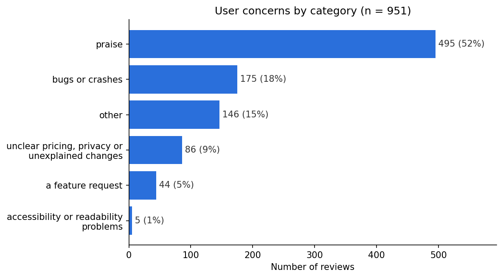
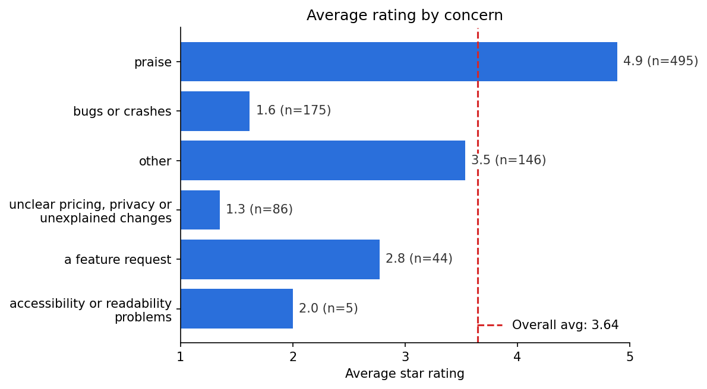
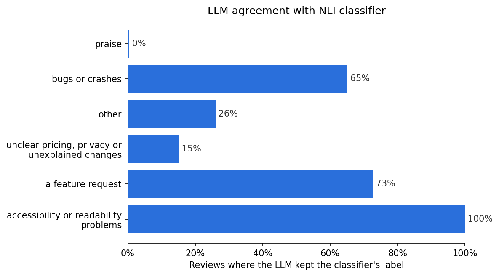

# App Review Analyzer

Collects Google Play reviews for an app, sorts them into user concerns with a zero-shot classifier, and has Claude check every classification.

The example run uses **Google Maps**, with the 1,000 most recent English reviews from the Australian Play Store.

## How it works

```
Google Play  ->  clean  ->  zero-shot NLI classifier  ->  Claude verification  ->  charts
```

| Step | File | What it does |
|---|---|---|
| 1. Collect | [src/getReviews.py](src/getReviews.py) | Downloads the newest reviews with `google-play-scraper` |
| 2. Clean | [src/cleanData.py](src/cleanData.py) | Drops user names and duplicates, tidies whitespace, keeps English reviews, converts dates |
| 3. Classify | [src/zero_shot_nli_classifier.py](src/zero_shot_nli_classifier.py) | Scores each review against every label with `facebook/bart-large-mnli` and picks the best one. Reviews whose best score is below 0.5 go to `other` |
| 4. Verify | [src/llm_verifier.py](src/llm_verifier.py) | Sends each label's reviews to Claude in one call. Claude returns a corrected label, a score and a reason for every review, plus a summary of that label |
| 5. Charts | [src/charts.py](src/charts.py) | Draws the charts and summary table below |

[src/app.py](src/app.py) runs steps 1–4 in order.

### Labels

- ADHD, focus or feeling overwhelmed
- accessibility or readability problems
- unclear pricing, privacy or unexplained changes
- bugs or crashes
- a feature request
- praise
- `other` (nothing fits)

## Setup

Requires Python 3.10+.

```bash
pip install -r requirements.txt
```

Create a `.env` file in the project root with your [Anthropic API key](https://console.anthropic.com/):

```
ANTHROPIC_API_KEY=your-key-here
```

`.env` is in `.gitignore`, so the key is never committed.

## Usage

```bash
# full pipeline: scrape, clean, classify, verify
python src/app.py

# quick test: classify and verify only the first 20 reviews
python src/app.py --limit 20

# charts and summary table from the verified results
python src/charts.py
```

Settings to know about:
- **App and number of reviews:** set `PLAY_STORE_APP_ID` and `MAX_REVIEWS` in [src/app.py](src/app.py).
- **Run time:** the first run downloads the BART model (about 1.6 GB). Classifying 1,000 reviews then takes about 25 minutes on a CPU.
- **Cost:** verification makes one Claude API call per label, so 7 calls for a full run.

## Output files

Everything is written to `results/`, and each run overwrites the previous files.

| File | Contents |
|---|---|
| `raw_reviews_data.xlsx` | Reviews as downloaded |
| `cleaned_reviews_data.xlsx` | Reviews after cleaning |
| `classified_reviews_data.xlsx` | Cleaned reviews plus `predicted_label` and `predicted_score` |
| `verified_reviews_data.xlsx` | One sheet per label with Claude's `verified_label`, `verified_score`, `changed` and `change_reason`, plus an `llm_comments` sheet with Claude's summary of each label |
| `summary_table.csv` | The results table below |
| `figures/*.png` | The charts below |

## Results

1,000 reviews were collected. 951 were left after cleaning (49 non-English reviews removed).

The table uses Claude's verified labels. *Agreement* is the share of reviews in each category where the classifier had already chosen the same label.

| Category | Reviews | % | Avg rating | Agreement % |
|---|---:|---:|---:|---:|
| praise | 495 | 52.1 | 4.9 | 0.4 |
| bugs or crashes | 175 | 18.4 | 1.6 | 65.1 |
| other | 146 | 15.4 | 3.5 | 26.0 |
| unclear pricing, privacy or unexplained changes | 86 | 9.0 | 1.3 | 15.1 |
| a feature request | 44 | 4.6 | 2.8 | 72.7 |
| accessibility or readability problems | 5 | 0.5 | 2.0 | 100.0 |

No reviews were placed in *ADHD, focus or feeling overwhelmed*, so it doesn't appear in the table.







### What users are saying

- **About half of the reviews are praise** (average 4.9★). Most are short, such as "good", "nice app" or "best map".
- **Bugs and crashes are the largest complaint** (18%, average 1.6★): crashes, freezes, lag, lost GPS signal, settings not saving and wrong routes.
- **Unexplained changes have the lowest ratings** (9%, average 1.3★). Users are mainly reacting to:
  - place renaming (Gulf of Mexico, Lake Ontario)
  - the new navigation voice and redesigns
  - sponsored results and forced tracking
- **Feature requests are few but specific** (5%, average 2.8★): EV charging stations, HGV routing, lane guidance, speed camera alerts, and better sorting and filters.
- **Accessibility complaints are rare** (5 reviews): hard-to-read fonts, road names that are hard to see and confusing timeline graphics.

### How well did the zero-shot classifier do?

Not well. Claude kept the classifier's label for only 204 of 951 reviews (21%), and changed the label on the other 747.

- **Praise was almost never detected.** The hypothesis template is *"The user is complaining about {}."*, and "The user is complaining about praise" makes no sense. As a result, 495 positive reviews fell below the threshold into `other` and had to be moved by Claude.
- **Uncertain reviews landed in the wrong labels.** The classifier often put empty, gibberish or very short reviews into *bugs or crashes* or *accessibility* with high confidence, instead of `other`.
- **Keywords misled it.** Words like "change", "private" or "money" triggered *unclear pricing*. Phrases like "bring it back" were read as feature requests, even when the review was a complaint about a change.
- **Its confidence scores are not reliable.** Many clear mistakes scored above 0.9.

The classifier did best on *bugs or crashes* (65% agreement) and *feature requests* (73%), where reviews use clear, typical wording.

### Limitations and next steps

- **One snapshot of one app:** the results come from 951 recent reviews from one country's store.
- **No human check:** Claude's labels are treated as the reference, but nobody has hand-checked them.
- **Better template:** a neutral hypothesis template, such as *"This review is about {}."*, would likely fix most of the praise errors.
- **Short reviews:** filtering out very short reviews (under about 3 words) before classifying would reduce the confident mistakes on them.

## Project structure

```
app_review_analyzer/
├── src/
│   ├── app.py                       # runs the pipeline
│   ├── getReviews.py                # step 1: scrape
│   ├── cleanData.py                 # step 2: clean
│   ├── zero_shot_nli_classifier.py  # step 3: classify
│   ├── llm_verifier.py              # step 4: verify with Claude
│   └── charts.py                    # step 5: charts and summary table
├── results/                         # output files and figures
├── requirements.txt
└── .env                             # your API key (not committed)
```
